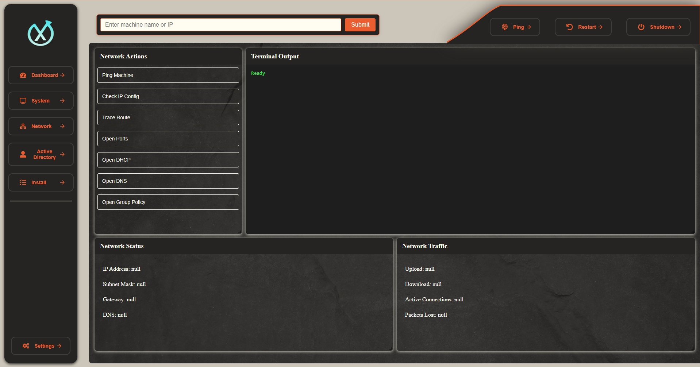

<h1>💥Xip</h1>

  

<h2>Xip is a remote IT administration tool  GUI designed to be a tailored made one stop shop for your environment. Built to be fast and lightweight using Tauri with a Rust backend.</h2>

---

# ✨ Features

**Xip** empowers IT admins with the ability to remotely manage and monitor systems effortlessly. Below are some of the key features:

### 🖥️ **Remote Access to Critical System Components**

Across your domain, **Xip** allows you to remotely access and manage the following key components of remote machines:

- **C$**: Remotely access the file system of a machine.
- **Local Users & Groups**: View and manage user accounts and groups on remote machines.
- **Shares**: Manage shared folders and network resources.
- **Services**: Start, stop, and manage system services remotely.
- **Event Logs**: Access and review event logs to troubleshoot or monitor activity.
- **Computer Management**: Access and manage all system management tools remotely.
- **Device Manager**: View and manage hardware devices on the remote machine.
- **Performance Monitor**: Keep track of system performance and resource usage in real-time.

---

### ⚙️ **Remote System Operations**

On remote machines, **Xip** allows you to run several useful commands and retrieve valuable system information, including:

- **Run `ipconfig /all`**: View detailed network configuration information.
- **Get the Current User**: See who is currently logged into the remote system.
- **System Uptime**: View how long the system has been running since the last boot.
- **Hardware Info & Usage**: Retrieve detailed hardware information and monitor usage stats.
- **Issue Shutdown & Restarts**: Remotely shut down or restart systems as needed.

---

### 🔗 **Convenient IT Shortcuts**

**Xip** also offers quick shortcuts for accessing essential IT tools, saving you time and effort:

- **Active Directory**: Access and manage your domain's Active Directory directly.
- **DNS**: Open the DNS management console.
- **DHCP**: Open the DHCP management console for network configuration.
- **Group Policy**: Quickly access Group Policy management.

---

---

### 🚧 **In Development**

While **Xip** already offers many powerful features, it’s still in heavy development! We have many exciting features planned, which you can find in our **[Roadmap](#Roadmap)**. My main goal for this project
is to allow users to completly customize a workflow that suits them best.

---

<h1>🌎Roadmap</h1>

The following is the roadmap for this project. Nothing is set in stone, and all suggestions are appreciated.

### v0.1.0-alpha - Launch Edition (Current)

- [x] Basic Computer Management
- [x] DHCP, DNS, Active Directory, & Group Policy shortcuts
- [x] Basic Network Tools
- [x] Basic Error handling

### v0.2.0 (Coming Soon)

- [ ] Implement querying for Server & Endstation information seen in the sections
- [ ] Add/Remove grid panels. Customize panels
- [ ] Implement winget and chocolatey for local and remote installations
- [ ] Allow easy implementation of private choco repos for custom applications
- [ ] Add auto launch into administrator mode
- [ ] Implement custom UI design options
- [ ] Fix bug related to authentication
- [x] Fix bug related to hanging processes 
- [ ] Add support for user profiles
- [ ] Implement search functionality
- [ ] Redesign user interface
- [ ] Explore AI integration
- [ ] Add RDP function, with option to replace with custom RDP. (Ex. RustDesk, DameWare, etc.)

---

<h1>🐛Known Bugs</h1>

- Grid Panels can be lost off screen if sized too large. Only solution right now is to refresh the app
- ~~There is a small chance (it happened once in hundreds of test during development) a process can get hung on the target machine when running Event Viewer. This locks the exe file, not allowing you to read, run, or modify the exe. End the process or restart both systems to fix.~~ (**Resolved**)
- Responsivness on ultrawides is incorrect. UI elements will be sized incorrectly.
- Device Mananger opens the local machines devices instead of targeted machine.

<h1>Installation</h1>

You can find the initial pre-release v0.1.0-alpha under the releases section in the repo. Alternatively, you can find the .exe in `src-tauri/target/release`. A unistaller is also included.

<h1>ℹ️Additional Information</h1>

> [NOTE]
>Xip is still in **heavy** development and is being worked on quite frequently. This has been a learning and hobby project for myself, and I do appreciate all feedback. Expect some errors and inefficiencies. 

> [!IMPORTANT]
>Some functions require remote powershell, however only a few. For larger environments this can easily be enabled in Group policy. The program needs to be ran as administrator, it currently does not auto auth via windows credentials.

